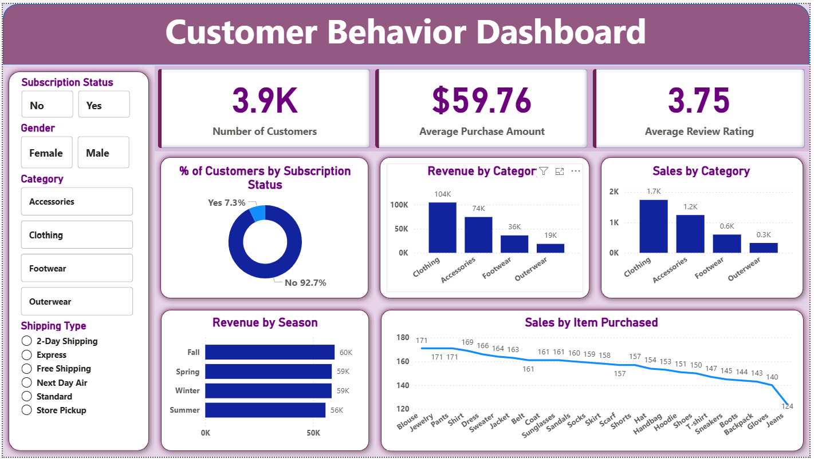

# Customer Behavior Dashboard

## Overview

This project demonstrates a **Customer Behavior Dashboard** that analyzes customer purchasing patterns, revenue, and sales trends. It uses **Power BI** for visualization, **MySQL** for database management, and **Jupyter Notebook** for data preprocessing and analysis.

## Features

* Interactive dashboard with KPIs:
  * Number of Customers
  * Average Purchase Amount
  * Average Review Rating
    
* Visualizations:
  * Subscription status distribution (donut chart)
  * Revenue and sales by category (bar charts)
  * Revenue by season
  * Sales by item purchased (line chart)
    
* Filters for Subscription Status, Gender, Product Category, and Shipping Type

## Tools & Technologies

* **Power BI:** Dashboard creation and visualization
* **MySQL:** Data storage and querying
* **Jupyter Notebook:** Data cleaning, preprocessing, and analysis

## Key Insights

* Majority of customers are non-subscribers (92.7%)
* Clothing is the highest revenue-generating category
* Revenue is highest during Fall and Winter seasons
* Top-selling items: Sweaters, Jackets, Shirts

## Benefits

* Helps understand customer behavior and preferences
* Identifies high-revenue categories and seasonal trends
* Supports marketing and inventory planning
* Easy-to-use, interactive dashboard for business decisions

## Dashboard Preview

